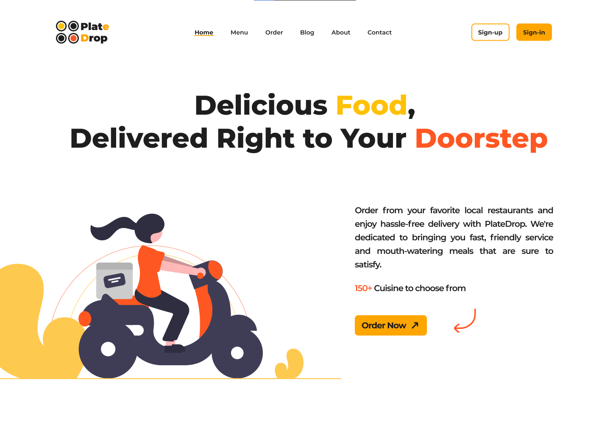
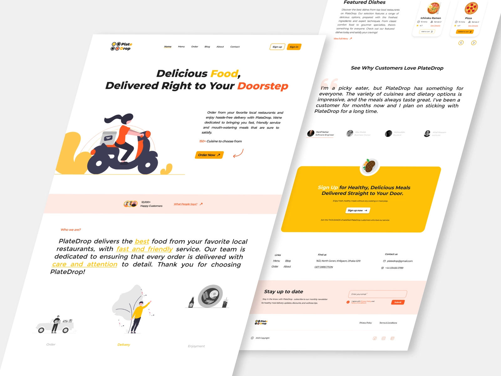
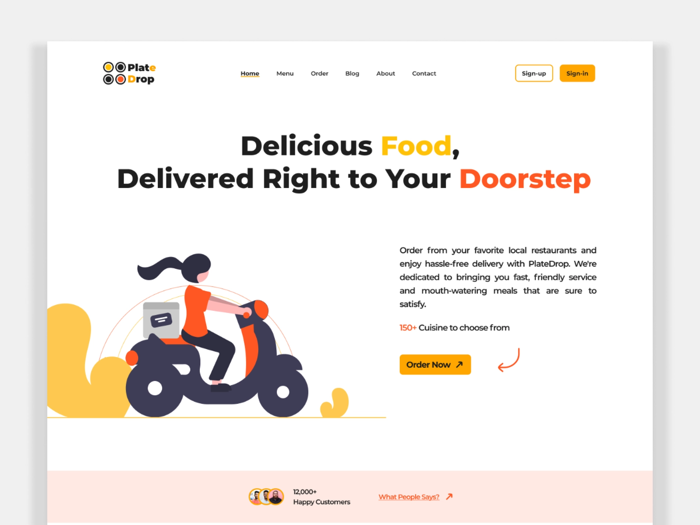
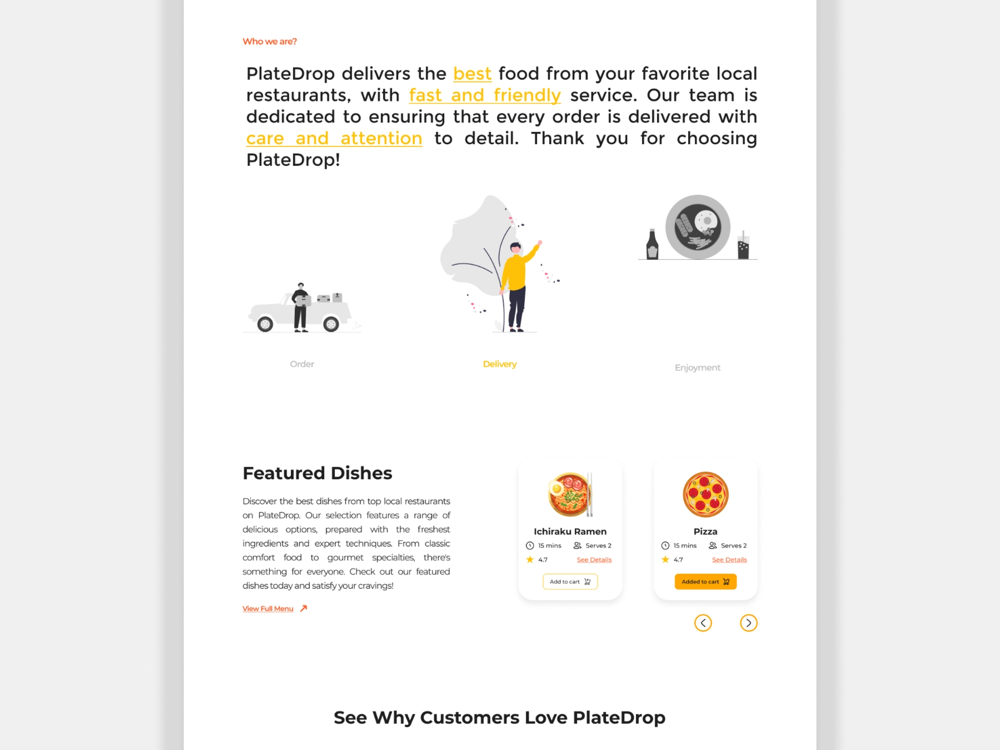
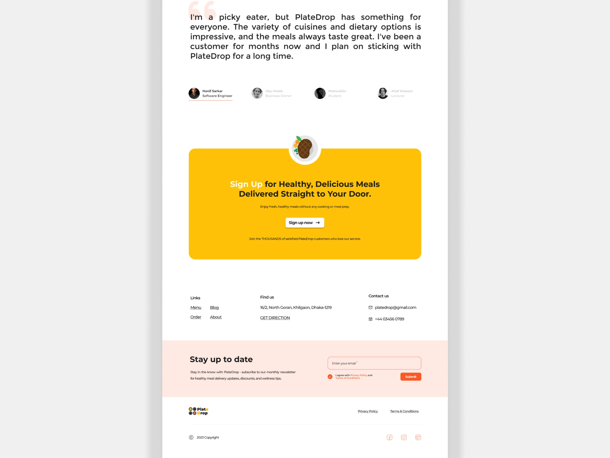

Table of Contents

 
<ul>
 

[About the Project](#💬-about-the-project)
 

[Design](#🎨-design)
 

[Jira Project Board](#📝-jira-project-board)
 

[Live App](#🚀-live-app)
 

[Installation and Setup](#🛠️-installation-and-setup)
 

[Running the App](#💻-running-the-app)
 

[Version of Dependencies](#💼-version-of-dependencies)
 

[Contributors](#🤝-contributors)
 

[Commit Messages](#📝-commit-messages)
 

[Acknowledgements](#🙏-acknowledgments)
 

[License](#📄-license)

 
</ul>

# 🍔 Food Delivery App with React

## 💬 About the Project
This is a private internal project for a food delivery app built with React. The purpose of this app is to offer a user-friendly and efficient way to order food online. This website is designed to offer a seamless experience for customers who are looking for a hassle-free way to order food from their favorite restaurants. This food delivery website offers a convenient and efficient way for customers to order food online. With its user-friendly interface, intuitive ordering system, and real-time order tracking, it is designed to make the food delivery experience as seamless as possible.

## 🎨 Design

    The design of this app was created using FIGMA. The design was created after a discussion with the product owner to get a sense of requirements for the final product. The basic branding of the service was done first. The information architecture of the website was then structured after conducting study on a few products in the same category. The design was implemented after getting a clear idea about the product.

You can view the design here: [Figma](https://www.figma.com/file/Ko8egmw3uhSwDUNakD33M2/Food_Delivery_Website?node-id=0-1&t=EomfDv7bDY6z3geH-0)

## 🏀 Dribbble

We used Dribbble to showcase our design process and share sneak peeks of our work with the design community. 
You can view the dribbble shot here:  [Dribbble](https://dribbble.com/shots/21153245-PlateDrop-Your-Hassle-Free-Food-Delivery-Solution)

## 📝 Jira Project Board
Jira project board is a tool that was used throughout the development process. Jira's project management capabilities allowed us to plan, track, and prioritize tasks in an organized and efficient manner.

With Jira we were able to create user stories, set project milestones, and manage sprints. The tool's customizable dashboards and reports provided real-time visibility into the project's progress, allowing us to make data-driven decisions and adjust priorities as needed.

Jira also enabled seamless collaboration amongst the team members, allowing us to communicate about project updates and issues directly within the platform.

Overall, Jira proved to be an invaluable asset to this project, enabling streamlined project management and fostering effective team collaboration.

You can find the Jira project board for this project here: [Jira](https://irstproject.atlassian.net/jira/software/projects/FD/boards/2)

## 🚀 Live App
Firebase Hosting was used to deploy and host this project. Firebase Hosting provided a fast and reliable hosting solution that made it easy to deploy and manage the website.

You can view the live version of the app here: [Live URL](https://food-delivery-website-60505.firebaseapp.com/)

## 🛠️ Installation and Setup

1. Clone the repository to your local machine: `git clone https://github.com/faizulislamfair/food-delivery-website.git`
2. Install Node JS. Refer to [NodeJS](#https://nodejs.org/en) for installation.
3. Navigate to the project directory: `cd <project-directory>`
4. Install the project dependencies: `npm install`
5. Start the app in development mode: `npm start`
6. Open [http://localhost:3000](http://localhost:3000) to view the app in the browser.

## 💻 Running the App

To run the app in development mode, use the following command: `npm start`

To build the app for production, use the following command: `npm run build`

## 💼 Version of Dependencies

## 🤝 Contributors

Currently there are 6 contributors for this repository.

  

- [Fahim Shariar](https://github.com/1810002) (Project Manager)  
Fahim Shariar was responsible for overseeing the production of all deliverables, including planning and monitoring the project's progress, conducting daily standups, and ensuring that all tasks were completed on schedule.

- [Md Rabby](https://github.com/Rabbi1810014) (Product Owner)  
Md Rabby's primary role was to define user stories and create a product backlog. He served as the main point of contact on behalf of the client and identified all product requirements to ensure that the final product meets the client's needs.

- [S.M. Faizul Islam Fair](https://github.com/faizulislamfair) (Team lead, Frontend Engineer & Code Reviewer) 
As a team lead and frontend engineer Faizul was responsible for overseeing the entire frontend development process and ensuring that the team delivered high-quality results. It was his responsilbity to design and implement the user interface and user experience of the software application. On the other hand, as a code reviewer he reviewed code changes made by other developer before they are merged into the main codebase. Code review is an essential part of the software development process as it helps to catch errors, improve code quality, and ensure that the code follows best practices and coding standards.

- [Musanna Galib](https://github.com/galib100) (Frontend Engineer & Code Reviewer)  
Musanna Galib played a critical role in the development of the website, and was responsible for creating a user-friendly and engaging interface that enhanced the user experience. He worked collaboratively with [Faizul](https://github.com/faizulislamfair) in Frontend development and code reviewing in the project. They were responsible for reviewing the code changes for correctness, completeness, maintainability, and performance.

- [Md Turag Islam](https://github.com/TuragLab) (UI/UX Designer)  
As the UI/UX designer of the project Md Turag Islam ensured that the website is visually appealing, easy to use, and provides an optimal user experience. His work helped to enhance the overall quality of the website and ensured that it met the needs of the target audience.

- [Md Zayed Al Masud](https://github.com/Zayed-26) (QA & Technical Writer) 
As the role of a QA  in the project Md Zayed Al Masud's job was to ensure the quality of the end product, by identifying and reporting any defects or issues that may impact the user experience. On the other hand, as the role of a technical writer his job was to create documentation that helps other in providing information about the project.

## 📝 Commit Messages

We follow the [Conventional Commits](https://www.conventionalcommits.org/en/v1.0.0/#summary) convention for commit messages.

## 🙏 Acknowledgments

We would like to thank the following open-source projects and libraries for their contributions to this app:

- <b> React </b>  
React is a free and open-source front-end JavaScript library for building user interfaces based on UI components. Its component-based architecture allowed us to create reusable UI elements and efficiently manage the product state. It is maintained by Meta and a community of individual developers and companies.

- <b> Firebase </b>  
Firebase is a set of backend cloud computing services and application development platforms provided by Google. It hosts databases, services, authentication, and integration for a variety of applications.

- <b> Material UI </b>  
Material UI is a popular React component library that provided us with pre-built UI components and a customizable design system. Material UI's extensive documentation and community support made it easy for us to style the project and ensure a consistent look and feel.

- <b> React Router </b>  
React Router is a routing library for React that provided us with declarative routing and navigation. React Router allowed us to define the application's structure and handle page transitions with ease.

## 📄 License

This project is licensed under the MIT License - see the [LICENSE](LICENSE) file for details.
